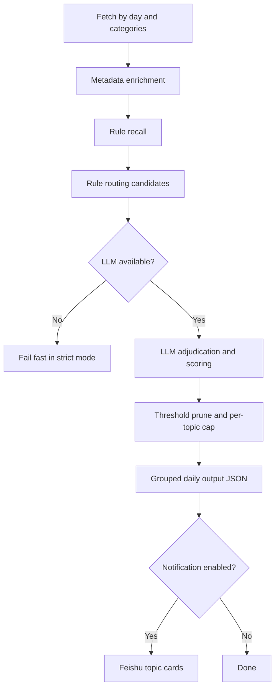

# arXiv Topic Intelligence Pipeline

一个面向团队日更的 arXiv 论文情报流水线：

**fetch -> recall -> route -> LLM judge -> score -> group -> notify**

---

## 1) 背景与目标

### 背景
做论文追踪时，常见问题不是“抓不到论文”，而是：
- 每天新增太多，人工筛选成本高
- 标题扫描很快，但误判多
- 真正值得精读的论文被噪音淹没

### 目标
这个项目的目标是把“看论文”变成一条稳定的日更流程：
1. 按自然日抓取目标类别
2. 先高召回，再高精度筛选
3. 对每篇保留论文给出可解释的判断依据
4. 输出稳定 JSON，便于推送、复盘和二次开发

---

## 2) 核心设计

### 2.1 设计思路（coarse-to-fine）
- **规则层（Recall/Route）**：低成本、保召回
- **LLM 层（Judge/Score）**：做最终语义判断
- **出榜层（Select/Group）**：按 topic 分组和限额

### 2.2 为什么是 LLM 必选
主流程默认是严格模式：
- `daily.require_llm=true`
- `daily.allow_rule_fallback=false`

含义：
- 缺少 LLM key / LLM 初始化失败时，任务直接失败（fail-fast）
- 不做 silent fallback，避免每日判断标准漂移

> 如果你确实要容错模式，可以把 `allow_rule_fallback` 改为 `true`。

### 2.3 流程图



---

## 3) 兴趣筛选（Interest Filtering）怎么做

### Layer A: Recall（召回）
目标：先不漏。对论文做关键词/主题词命中，生成：
- `recall_hits`
- `recall_hit_count`

### Layer B: Rule Routing（规则路由）
目标：给 LLM 一个先验：
- `rule_topic_id`
- `rule_subtopic`
- `rule_score`
- `rule_ambiguous`

### Layer C: LLM Adjudication（LLM 裁决）
输入：title / abstract / categories / comment + rule priors + rubric。  
输出：
- `topic_id`, `subtopic`
- `keep`, `relevance`, `confidence`
- `reason`, `one_sentence_summary`

#### LLM 的筛选先验（当前实现）
每篇论文送入 LLM 前，会携带这些“兴趣先验”字段：
- `rule_topic_id`, `rule_subtopic`
- `rule_candidates`（候选 topic + 分数）
- `recall_hits`（命中的兴趣词）
- `primary_category`, `categories`
- `title`, `abstract`, `comment`

这些先验的作用是：
- 不让 LLM 从零开始猜主题
- 让 LLM 判断更贴近你的关注方向（而不是泛化判断）
- 保留可解释链路（为什么被判进这个 topic）

#### LLM 判别逻辑（当前实现）
- 先由规则层给出候选与弱排序
- LLM 在候选基础上做最终语义判别（topic / keep / relevance）
- 最终再由阈值与 topic 限额做出榜

默认是严格模式：
- LLM 不可用时 fail-fast
- 不做 silent rule fallback（避免“今天是 LLM 标准，明天是规则标准”）

### Layer D: Select & Group（出榜）
- 过滤 `keep=false`
- 应用 `relevance_threshold`
- topic 内排序并按上限截断
- 形成最终日报结构

---

## 4) 项目结构（主干）

```text
.
├── main.py                      # 兼容入口（deprecated，转发到 run_daily）
├── config/config.yaml
├── src/
│   ├── pipeline/run_daily.py    # 主入口 CLI
│   ├── pipeline/daily_graph.py  # 日更流程图
│   ├── pipeline/routing.py      # 召回与规则路由
│   ├── pipeline/topics.py       # topic taxonomy
│   └── ...
├── tests/
├── scripts/                     # 可选脚本（如微信公众号发布）
└── archive/                     # 历史文档/工具归档
```

---

## 5) 快速开始

### 5.1 安装

```bash
pip install -r requirements.txt
```

### 5.2 配置密钥
创建 `env/.env`：

```bash
OPENROUTER_API_KEY=your_key_here
```

### 5.3 运行日更

```bash
python -m src.pipeline.run_daily --config config/config.yaml --day YYYY-MM-DD
```

示例（今天是 2026-02-07）：

```bash
python -m src.pipeline.run_daily --config config/config.yaml --day 2026-02-07
```

常用参数：

```bash
# 本次强制发送 Feishu
python -m src.pipeline.run_daily --config config/config.yaml --day 2026-02-07 --notify-feishu

# 本次不推送
python -m src.pipeline.run_daily --config config/config.yaml --day 2026-02-07 --no-notify

# 覆盖卡片每个 topic 展示条数
python -m src.pipeline.run_daily --config config/config.yaml --day 2026-02-07 --per-topic 3
```

> 当 `daily.require_llm=true` 时，`--no-llm` 不可用。

---

## 6) 关键配置说明（`config/config.yaml` -> `daily`）

- `timezone`: 日历日时区
- `categories`: 抓取类别
- `max_results`: 每类抓取上限
- `relevance_threshold`: 最终保留阈值
- `llm_enabled`: 是否启用 LLM 裁决
- `require_llm`: 是否强制 LLM（建议 true）
- `allow_rule_fallback`: LLM 失败是否允许规则兜底（建议 false）
- `llm_scope`: `all` / `ambiguous_only`
- `llm_batch_size`, `llm_parallel_workers`, `llm_batch_retries`
- `llm_vote_enabled`, `llm_vote_model`
- `save_intermediates`: 是否落盘中间 JSONL
- `notification.*`: 日报推送配置

说明：严格模式（`allow_rule_fallback=false`）下，为保持一致性，`ambiguous_only` 会提升为全量 LLM 判别。

### 6.1 围绕“个人兴趣”重点调这几个参数

如果你希望结果更贴近你的研究方向，优先调这 4 项：

1. `daily.categories`
   - 定义“你的研究池子”从哪些 arXiv 类别抓。

2. `daily.rubric_text`
   - 这是给 LLM 的兴趣评估标准（建议写成你自己的关注点/排除项）。

3. `daily.relevance_threshold`
   - 控制“多严”才保留：
     - 高阈值：更少、更精准
     - 低阈值：更多候选，容忍噪音

4. `daily.llm_scope`
   - `all`：每篇候选都走 LLM，最稳定
   - `ambiguous_only`：仅歧义样本走 LLM（严格模式下会提升为全量）

建议调参顺序：先 `categories` -> 再 `rubric_text` -> 再 `relevance_threshold`。

---

## 7) 输出数据说明

默认输出：
- `data/index/<day>/daily_topics.json`

可选中间产物：
- `raw.jsonl`
- `enriched.jsonl`
- `recalled.jsonl`
- `routed.jsonl`
- `scored.jsonl`

`daily_topics.json` 顶层字段：
- `day`, `timezone`, `rubric`, `threshold`, `llm_enabled`, `topics`

每篇论文关键字段：
- 基础信息：`paper_id`, `title`, `abstract`, `authors`, `entry_url`, `pdf_url`
- 判别信息：`topic_id`, `subtopic`, `relevance`, `confidence`, `keep`, `reason`
- 召回痕迹：`recall_hits`, `recall_hit_count`
- 一句话摘要：`one_sentence_summary`

---

## 8) 常见问题

- **没有抓到论文**
  - 检查 `daily.categories`、`max_results`、`--day`、时区设置。

- **启动即报 LLM 错误**
  - 检查 `OPENROUTER_API_KEY` 是否可读。
  - 严格模式下这是预期行为（fail-fast）。

- **筛选结果不符合预期**
  - 打开中间产物 `recalled/routed/scored.jsonl` 定位问题阶段。

- **推送失败**
  - 检查 `daily.notification.feishu` 或全局 `notification.feishu` 回退配置。

---

## 9) 开发与测试

运行全部测试：

```bash
python -m pytest -q
```

运行核心流程测试：

```bash
python -m pytest -q tests/test_pipeline_daily_graph.py
```

---

## 10) 可选模块与历史内容

- `feedback.py`: 反馈收集 CLI
- `scripts/publish.py`: 微信公众号发布辅助
- `scripts/wechat_setup.py`: 微信配置辅助
- `examples/`: 低层示例脚本

历史文档和实验工具在 `archive/`，新接入建议从本 README + `src.pipeline.run_daily` 开始。
